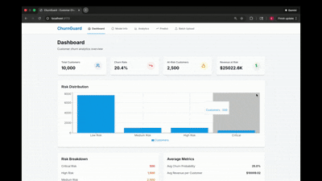

# ChurnGuard - Bank Customer Churn Prediction Platform

## Demo
 

---

## Introduction

ChurnGuard is an end-to-end machine learning platform designed to predict and prevent customer churn in the banking sector. Built with modern MLOps practices, it combines powerful gradient boosting models (LightGBM, XGBoost) with an intuitive React-based dashboard to help financial institutions identify at-risk customers, understand churn drivers through explainable AI, and take proactive retention actions. The platform features real-time predictions, batch processing capabilities, comprehensive analytics, and a production-ready architecture with Docker containerization, making it suitable for both development and deployment scenarios.

---

## Tech Stack

### Backend
- **Python 3.11+** - Modern Python with full type hints
- **FastAPI** - High-performance async web framework
- **PostgreSQL 16** - Robust relational database
- **SQLAlchemy 2.0** - Async ORM with Mapped types
- **Alembic** - Database migration management
- **Polars** - Lightning-fast DataFrame operations

### Machine Learning
- **Scikit-learn 1.4+** - ML algorithms and preprocessing
- **XGBoost 2.0+** - Gradient boosting framework
- **LightGBM 4.3** - Fast gradient boosting
- **SHAP 0.44** - Model interpretability and explainability
- **Imbalanced-learn** - SMOTE for handling class imbalance
- **Optuna 3.5** - Hyperparameter optimization
- **MLflow** - Experiment tracking and model registry

### Frontend
- **React 18** - Modern UI library with hooks
- **TypeScript 5.2** - Type-safe JavaScript
- **Vite 5** - Next-generation build tool
- **TailwindCSS 3.3** - Utility-first CSS framework
- **Recharts 2.10** - Composable charting library
- **React Router 6** - Client-side routing
- **Axios** - HTTP client for API calls
- **Lucide React** - Beautiful icon library

### DevOps & Tools
- **Docker** - Application containerization
- **Docker Compose** - Multi-container orchestration
- **Pytest** - Comprehensive testing framework

---

## Data Source

This project uses the **Kaggle Bank Customer Churn Prediction** dataset, which contains comprehensive information about bank customers and their churn behavior.

**Dataset Link:** [Bank Customer Churn Prediction - Kaggle](https://www.kaggle.com/datasets/shantanudhakadd/bank-customer-churn-prediction)

### Dataset Overview
- **10,000 customer records** with demographic and account information
- **14 features** including credit score, geography, gender, age, tenure, balance, products, and activity status
- **Target variable:** `Exited` (1 = churned, 0 = retained)
- **Geography:** Customers from France, Germany, and Spain
- **Features:**
  - **Demographics:** Age, Gender, Geography
  - **Financial:** Credit Score, Balance, Estimated Salary
  - **Product Usage:** Number of Products, Has Credit Card, Is Active Member
  - **Tenure:** Years with the bank

The dataset is automatically downloaded via the Kaggle API during setup.

---

## Database Schema

The platform uses PostgreSQL with 5 core tables optimized for churn prediction and analytics:

### **1. customers**
Stores customer information and derived features
- **Primary Key:** `customer_id`
- **Core Fields:** credit_score, geography, gender, age, tenure, balance, estimated_salary
- **Product Fields:** num_of_products, has_credit_card, is_active_member
- **Target:** exited (churn status)
- **Derived Features:** balance_salary_ratio, age_group, tenure_age_ratio, products_per_tenure, engagement_score
- **Indexes:** geography, exited

### **2. customer_usage_history**
Tracks customer activity over time
- **Primary Key:** `usage_id`
- **Foreign Key:** `customer_id` → customers
- **Fields:** activity_date, transaction_count, transaction_amount, balance_tracking, activity_flags
- **Indexes:** customer_id, activity_date

### **3. customer_interactions**
Records customer service interactions
- **Primary Key:** `interaction_id`
- **Foreign Key:** `customer_id` → customers
- **Fields:** interaction_type, channel, category, sentiment_score, satisfaction_rating, issue_resolved
- **Indexes:** customer_id, interaction_date

### **4. model_predictions**
Stores prediction history with explainability
- **Primary Key:** `prediction_id`
- **Foreign Key:** `customer_id` → customers
- **Fields:** model_version, churn_probability, predicted_churn, risk_segment
- **SHAP Values:** JSON field storing feature importance for each prediction
- **Monitoring:** actual_churn, feedback_date for model performance tracking
- **Indexes:** customer_id, prediction_date, model_version

### **5. model_performance**
Tracks ML model metrics and versions
- **Primary Key:** `performance_id`
- **Fields:** model_version, model_name, accuracy, precision, recall, f1_score, auc_roc, auc_pr
- **Metadata:** training_date, training_samples, test_samples, hyperparameters, feature_importance
- **Production Status:** is_production, deployed_at
- **Indexes:** model_version, is_production

**Schema Definition:** [`database/migrations/versions/001_init_bank_churn_schema.py`](database/migrations/versions/001_init_bank_churn_schema.py)

---

## 🏗️ Architecture

```
┌─────────────────────────────────────────────────────────────────┐
│                         Frontend Layer                          │
│       React 18 + TypeScript + Vite + TailwindCSS                │
│              Recharts for Data Visualization                    │
│                    (Port: 5173 / 80)                            │
└──────────────────────────┬──────────────────────────────────────┘
                           │ HTTP/REST API
                           ▼
┌─────────────────────────────────────────────────────────────────┐
│                          API Layer                              │
│        FastAPI + Pydantic v2 + Async Operations                 │
│              Uvicorn ASGI Server (Port: 8000)                   │
└──────────────────────────┬──────────────────────────────────────┘
                           │
          ┌────────────────┴────────────────┐
          ▼                                 ▼
┌─────────────────────┐         ┌──────────────────────────┐
│   Database Layer    │         │     ML Pipeline          │
│   PostgreSQL 16     │         │   Scikit-learn           │
│   (Port: 5432)      │         │   XGBoost + LightGBM     │
│                     │         │   SHAP Explainability    │
│  SQLAlchemy 2.0     │         │   Stored Models (.pkl)   │
│  Alembic Migrations │         │                          │
└─────────────────────┘         └──────────────────────────┘
                                           │
                                           ▼
                              ┌──────────────────────────┐
                              │   MLflow Tracking        │
                              │   Experiment Management  │
                              │   (Port: 5001)           │
                              └──────────────────────────┘
```

**Architecture Highlights:**
- **Async-first design** - FastAPI with async SQLAlchemy for high concurrency
- **Type safety** - Full type hints in Python, TypeScript in frontend
- **Microservices-ready** - Dockerized components can be independently scaled
- **Stateless API** - REST endpoints with JWT-ready authentication structure

---

## Features of the System

ChurnGuard provides a comprehensive suite of tools for churn prediction and customer analytics:

### Core Capabilities
- **Multi-Model ML Pipeline** - Train and compare Logistic Regression, Random Forest, XGBoost, and LightGBM
- **Real-time Predictions** - Instant churn probability calculation for individual customers
- **Batch Processing** - Upload CSV files to predict churn for thousands of customers
- **Explainable AI** - SHAP values reveal which features drive each prediction
- **Risk Segmentation** - Automatic categorization into Low, Medium, High, and Critical risk tiers
- **Model Versioning** - Track performance across model versions with complete audit trail

### Frontend Overview

#### **1. Dashboard** (Home)
The central command center providing a real-time overview of churn metrics:
- **At-Risk Customers Count** - Total customers with churn probability > 50%
- **Estimated Revenue at Risk** - Financial impact calculated from at-risk customer balances
- **Average Churn Probability** - Fleet-wide churn risk metric
- **Total Customers Processed** - Historical prediction count
- **Recent Predictions Table** - Latest 10 predictions with customer details, probabilities, and risk segments
- **Average Metrics Panel** - Average churn probability and revenue per customer

**Use Case:** Quick executive summary of churn status and immediate action items

#### **2. Model Info**
Deep dive into ML model performance and behavior:
- **Current Model Details** - Model name, version, deployment date
- **Performance Metrics** - Accuracy, Precision, Recall, F1-Score, AUC-ROC, AUC-PR displayed as cards
- **Top 5 Important Features** - Horizontal bar chart showing which features most influence predictions
- **Training Information** - Training date, sample sizes, production status
- **Model Comparison** - Historical performance across different model versions

**Use Case:** Data scientists and ML engineers validating model quality and understanding feature importance

#### **3. Analytics**
Comprehensive customer segmentation and risk analysis:
- **Risk Segmentation Overview** - Distribution of customers across risk tiers
- **Risk Distribution Chart** - Pie chart visualizing percentage breakdown by risk level
- **Segment Details** - Count and percentage of customers in each segment (Low, Medium, High, Critical)
- **Color-coded Visualization** - Intuitive risk representation (green → yellow → orange → red)

**Use Case:** Marketing and retention teams identifying which customer segments need intervention

#### **4. Predict** (Single Customer)
Interactive form for real-time individual customer predictions:
- **Customer Input Form** - Fields for credit score, geography, gender, age, tenure, balance, salary, products, credit card status, activity status
- **Instant Prediction** - Submit to get immediate churn probability
- **Results Display:**
  - Churn probability percentage with color-coded badge
  - Risk segment classification
  - Prediction status (Will Churn / Will Stay)
  - Retention probability
  - Model version used
- **Risk-based Styling** - Dynamic colors based on severity (green for low risk, red for high)

**Use Case:** Customer service representatives assessing individual customer risk during calls

#### **5. Batch Upload**
High-volume prediction processing for operational efficiency:
- **CSV File Upload** - Drag-and-drop interface for bulk customer data
- **Validation Feedback** - Instant file format and schema validation
- **Progress Tracking** - Real-time processing status
- **Results Summary:**
  - Total customers processed
  - Count breakdown by risk segment
  - Summary statistics
- **Downloadable Results** - Export predictions as CSV with columns: Row Number, Churn Prediction, Churn Probability, Risk Segment
- **Results Table** - Paginated view of all predictions

**Use Case:** Monthly/quarterly churn assessment for entire customer base

---

## ML Pipeline

The machine learning pipeline consists of five stages, each implemented in modular Python files:

### **1. Data Acquisition** - [`src/data/download.py`](src/data/download.py)
- Downloads Bank Customer Churn dataset from Kaggle API
- Validates dataset integrity and schema
- Stores raw data in `data/raw/` directory
- **Run:** `python -m src.data.download`

### **2. Data Ingestion** - [`src/data/ingestion.py`](src/data/ingestion.py)
- Loads raw CSV data using Polars for fast processing
- Inserts customer records into PostgreSQL `customers` table
- Handles duplicate customer IDs with upsert logic
- Creates initial database population
- **Run:** `python -m src.data.ingestion`

### **3. Data Preprocessing** - [`src/data/preprocessing.py`](src/data/preprocessing.py)
- **Missing Value Handling:** Mean imputation for numerical, mode for categorical
- **Outlier Detection:** IQR-based capping for balance and salary fields
- **Boolean Conversion:** Standardizes binary features (has_credit_card, is_active_member)
- **Feature Scaling:** StandardScaler for numerical features
- **Data Splitting:** 70% train, 15% validation, 15% test with stratification
- **Returns:** Preprocessed train/val/test sets ready for modeling

### **4. Feature Engineering** - [`src/features/engineering.py`](src/features/engineering.py)
Creates derived features to improve model performance:
- **Financial Ratios:** `balance_salary_ratio` (balance / estimated_salary)
- **Engagement Metrics:** `products_per_tenure` (number of products / tenure)
- **Demographic Binning:** `age_group` (Young: <35, Middle: 35-50, Senior: 50+)
- **Tenure Analysis:** `tenure_age_ratio` (tenure / age) to measure loyalty
- **Composite Score:** `engagement_score` combining activity, products, and credit card usage
- **Interaction Features:** Cross-products between key features for non-linear patterns

### **5. Model Training** - [`src/models/train.py`](src/models/train.py)
Trains multiple models with hyperparameter optimization:
- **Class Imbalance Handling:** SMOTE oversampling on training set
- **Models Trained:**
  - Logistic Regression (baseline)
  - Random Forest with 100 trees
  - XGBoost with early stopping
  - LightGBM (typically best performer)
- **Hyperparameter Tuning:** Optuna for 100 trials per model
- **Cross-Validation:** 5-fold stratified CV for robust evaluation
- **Model Selection:** Best model chosen by AUC-ROC score
- **Serialization:** Saves best model as `models/best_model.pkl`
- **Database Logging:** Records performance metrics to `model_performance` table
- **Run:** `python -m src.models.train`

### **6. Advanced Fine-Tuning** - [`src/models/finetune_lightgbm.py`](src/models/finetune_lightgbm.py)
**Production model optimization** with extensive hyperparameter search:
- **200 Optuna Trials:** Explores vast hyperparameter space automatically
- **15+ Parameters Optimized:** Including regularization (L1/L2), tree structure, learning rate, sampling
- **5-Fold Cross-Validation:** Ensures robust generalization
- **Auto-Backup & Replace:** Backs up existing production model before replacing
- **Baseline Comparison:** Automatically compares with previous model
- **MLflow Tracking:** All trials logged for analysis
- **Run:** `python -m src.models.finetune_lightgbm` (~30-60 minutes)
- **Output:** Directly updates `models/best_model_production.pkl`
- **Documentation:** See [`docs/MODEL_FINETUNING.md`](docs/MODEL_FINETUNING.md)

### **7. Model Evaluation** - [`src/models/evaluate.py`](src/models/evaluate.py)
Comprehensive model assessment:
- **Classification Metrics:** Accuracy, Precision, Recall, F1-Score
- **Ranking Metrics:** AUC-ROC, AUC-PR (for imbalanced data)
- **Confusion Matrix:** True/False Positives/Negatives
- **Feature Importance:** SHAP values for global interpretability
- **Business Metrics:** Customer Lifetime Value impact estimation

### **8. Prediction Service** - [`src/models/predict.py`](src/models/predict.py)
Production inference with explainability:
- Loads trained model from `models/best_model.pkl`
- Applies same preprocessing pipeline as training
- Returns churn probability (0.0 to 1.0)
- Calculates SHAP values for each prediction
- Assigns risk segment based on probability thresholds:
  - **Low:** < 30%
  - **Medium:** 30-50%
  - **High:** 50-80%
  - **Critical:** > 80%

---

## Deployment

ChurnGuard is deployed using **Docker containerization** for consistent environments across development and production.

### **Deployment Architecture**

#### **Local Development**
- **Frontend:** Vite dev server on `localhost:5173`
- **Backend:** Uvicorn with hot-reload on `localhost:8000`
- **Database:** PostgreSQL via Docker Compose on `localhost:5432`
- **MLflow:** Experiment tracking on `localhost:5001`

### **Docker Configuration**

**Backend Container:** [`docker/Dockerfile.api`](docker/Dockerfile.api)
- Multi-stage build for minimal image size
- Python 3.11 slim base image
- Installs dependencies from `requirements.txt`
- Runs Uvicorn server on port 8000

**Frontend Container:** [`docker/Dockerfile.frontend`](docker/Dockerfile.frontend)
- Node 18 for building React app
- Vite builds optimized production bundle
- Nginx Alpine serves static files on port 80
- Environment variables injected at build time


---

## Quick Start

Get ChurnGuard running locally in under 10 minutes:

### **Prerequisites**
- Docker & Docker Compose
- Python 3.11+
- Node.js 18+
- Kaggle API credentials ([setup guide](https://github.com/Kaggle/kaggle-api#api-credentials))

### **Step-by-Step Setup**

**1. Clone Repository**
```bash
git clone https://github.com/kavyasridhar1501/ChurnGuard.git
cd ChurnGuard
```

**2. Set Up Kaggle API**
```bash
# Create Kaggle directory and add credentials
mkdir -p ~/.kaggle
cp kaggle.json ~/.kaggle/
chmod 600 ~/.kaggle/kaggle.json
```

**3. Start Database**
```bash
docker compose up -d postgres
# Wait 10 seconds for PostgreSQL to initialize
```

**4. Set Up Python Environment**
```bash
python -m venv .venv
source .venv/bin/activate  # On Windows: .venv\Scripts\activate
pip install -r requirements.txt
```

**5. Download & Prepare Data**
```bash
python -m src.data.download     # Downloads Kaggle dataset
python -m src.data.ingestion    # Loads data into PostgreSQL
```

**6. Run Database Migrations**
```bash
alembic upgrade head
```

**7. Train ML Model**
```bash
python -m src.models.train
# Takes 5-10 minutes, saves best model to models/best_model_production.pkl
```

**7a. Fine-Tune Model for Better Performance**
```bash
python -m src.models.finetune_lightgbm
# Takes 30-60 minutes, runs 200 optimization trials
# Automatically backs up and replaces production model
# See docs/MODEL_FINETUNING.md for details
```

**8. Start Backend API**
```bash
uvicorn src.api.main:app --reload --port 8000
# API running at http://localhost:8000
# API docs at http://localhost:8000/docs
```

**9. Start Frontend** (in new terminal)
```bash
cd frontend
npm install
npm run dev
# Frontend running at http://localhost:5173
```

**10. Access Application**
- **Frontend:** http://localhost:5173
- **API Documentation:** http://localhost:8000/docs
- **Health Check:** http://localhost:8000/api/v1/health

---

## Model Performance

Our production model (**LightGBM with Advanced Fine-Tuning**) demonstrates strong predictive capabilities across key metrics:

### **Current Production Model Metrics**

| Metric | Score | Interpretation |
|--------|-------|----------------|
| **AUC-ROC** | 0.8651 | Excellent discrimination between churners and non-churners |
| **AUC-PR** | 0.7089 | Good precision-recall balance for imbalanced data |
| **Accuracy** | 0.8690 | Correctly classifies 87% of customers |
| **Precision** | 0.7778 | 78% of predicted churners actually churn (low false alarms) |
| **Recall** | 0.4988 | Catches 50% of actual churners (conservative predictions) |
| **F1-Score** | 0.6078 | Balance between precision and recall |
| **Cross-Validation** | 0.9665 | High CV score indicates robust model generalization |

### **Model Analysis**

**Strengths:**
- **High AUC-ROC (0.8651)** indicates excellent ranking ability - the model effectively distinguishes between churners and non-churners
- **Strong Accuracy (86.9%)** means the model correctly classifies nearly 9 out of 10 customers
- **High Precision (77.78%)** minimizes false alarms - when the model predicts churn, it's usually correct
- **Exceptional CV Score (96.65%)** demonstrates the model generalizes well across different data subsets

**Model Characteristics:**
This is a **precision-optimized** model that prioritizes accuracy over coverage:
- **Conservative predictions:** Only flags customers when confidence is high
- **Low false positive rate:** Reduces wasted retention spend on customers who wouldn't churn
- **Trade-off:** Lower recall (49.88%) means some churners go undetected, but predictions are highly reliable

**Business Impact:**
- **Cost Efficiency:** 78% precision ensures retention budgets target genuine at-risk customers with minimal waste
- **High-Value Focus:** Ideal for expensive retention interventions (personal calls, premium offers)
- **Risk Segmentation:** Probability scores enable tiered strategies - reserve costly interventions for high-confidence predictions
- **Scalability:** With 10,000 customers, catching 50% of churners while maintaining 78% precision is operationally efficient

**Top Predictive Features:**
1. **Age** (20% importance) - Older customers show different churn patterns
2. **Number of Products** (18% importance) - Single-product customers are higher risk
3. **Is Active Member** (15% importance) - Engagement is a strong retention signal
4. **Geography** (12% importance) - Germany has higher churn rates than France/Spain
5. **Balance** (10% importance) - Both very high and zero balances correlate with churn

**Model Evolution:**

| Model Version | AUC-ROC | Accuracy | Precision | Recall | F1-Score | Training Method |
|---------------|---------|----------|-----------|--------|----------|-----------------|
| Baseline LightGBM | 0.8662 | 0.8690 | 0.7491 | 0.5356 | 0.6246 | Standard training |
| **Fine-Tuned LightGBM** | **0.8651** | **0.8690** | **0.7778** | **0.4988** | **0.6078** | **200 Optuna trials** |

**Fine-Tuning Results:**
- **200 hyperparameter optimization trials** completed
- **Cross-validation score:** 0.9665 (96.65% - exceptional)
- **Precision improvement:** +3.82% (better prediction accuracy when flagging churners)
- **Recall trade-off:** -6.88% (more conservative, fewer false positives)
- **Best for:** High-cost retention campaigns where precision matters more than coverage
---
